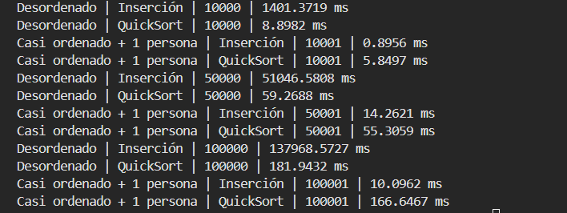

Practica N4 

Asginatura Estructura de datos

Nombre : Xavier Aucay

Fecha de entrega : 2/6/2026

### ¿Cual algortimo fue el mas rapido en el escenario desordenado?
El algoritmo mas Rpido fue el de quickSort, ya que con 100000 elementos tardo tan solo 182 ms aproximadamente mientras que con insercion hay una clara diferencia de 137968.57 ms. 
### ¿Que algoritmo fue mas rapido en el escenario casi ordenado? 
El insercion fu el mas rapido, ya que solo reubicaba un elemento, en 1000001 tardo 10 ms contra 166 ms del QuickSort.
### ¿El crecimiento del tamaño de muestra afectó por igual a los dos algoritmos?  
No, insercion aumento drasticamente en tiempo conforme aumento el tamaño, mientras que quicksort escalo de mejor manera manteniendo tiempos bajos.
### ¿Por qué Inserción puede mejorar cuando el arreglo ya está casi ordenado?  
Porque el metodo de insercion solo hace unas pocas comparaciones, asi este evita recorrer todo el arreglo.
### ¿Por qué QuickSort suele ser mejor cuando los datos están muy desordenados?  
Es mejor porque divide el problema en sub arreglos y logra asi un mejor rendimiento que el de insercion en datos desordenados.

## Conclusiones

El algoritmo mas eficiente en arreglos muy grandes fue el de QuickSort, mostro tiempos bajos a comparacion con los de insercion. 

Insercion superó a Quick sort cuando los elementos estaban casi ordenados, es el mas adecuado cuando los datos ya estan en un orden parcial. 

El tamaño del arreglo afecta de distinta manera a los algoritmos, por ejemplo insercion escala mal los arreglos grandes, es mas tardado, mientras que quickSort tiene un crecimiento mucho mas controlado.
